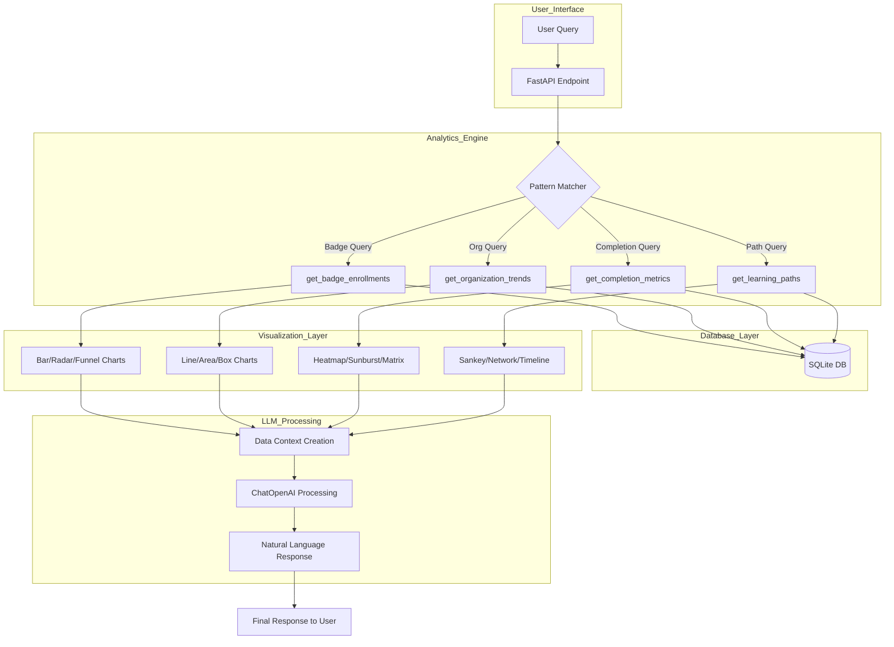

Here's how this analytics engine works with LLM integration. Here's a Mermaid flowchart followed by a detailed explanation:



1. Query Processing:

- User submits a natural language query (e.g., "How many people are enrolled in Python Basics badge?")
- The system uses regex patterns to categorize the query into one of four types:

```
badge_pattern = r"(?i)(how many|enrollments?|users?).+(?:badge|course)"
org_pattern = r"(?i)(how many|enrollments?|users?).+(?:organization|org)"
trend_pattern = r"(?i)(trend|over time|historical)"
completion_pattern = r"(?i)(completion|success).+(rate|percentage)"
```

2. Data Retrieval:

Based on the query type, calls appropriate method:

- get_badge_enrollments(): Badge-specific stats
- get_organization_trends(): Organization enrollment trends
- get_completion_metrics(): Detailed completion analytics
- get_learning_paths(): User learning progression analysis

3. Visualization Generation: Each method generates multiple visualizations:

# Example from get_badge_enrollments

```
visualizations = {
    "bar": enrollment_chart,
    "radar": completion_rates,
    "funnel": enrollment_pipeline,
    "bubble": multi_dimensional_analysis
}
```

4. LLM Integration: The LLM (ChatGPT) plays several crucial roles:

# Enhancement of query with context

```
enhanced_query = f"""
Based on the following data:
- Total Users: {stats['total_users']}
- Total Badges: {stats['total_badges']}
- Total Enrollments: {stats['total_enrollments']}

Analytics Data:
{json.dumps(analytics_data, indent=2)}

Please analyze this query: {query}
"""

# LLM processes this enhanced query
response = conversation.predict(input=enhanced_query)
```

The LLM:

- Interprets raw data in context
- Generates natural language explanations
- Provides insights beyond raw numbers
- Maintains conversation history for context

5. Response Structure:

```
return {
    "response": llm_response,
    "type": "analytics",
    "metadata": {
        "confidence": 0.9,
        "database_stats": stats,
        "analytics_data": data
    },
    "visualization": visualization_json
}
```

Key Features:

1. Multi-dimensional Analysis: Each query type generates multiple visualization perspectives
2. Context-Aware Responses: LLM considers both historical data and current query context
3. Interactive Visualizations: Uses Plotly for dynamic, interactive charts
4. Flexible Query Handling: Pattern matching allows for natural language variation
5. Rich Metadata: Provides comprehensive statistics alongside main results

The LLM's primary value-add is:

- Converting raw data into meaningful insights
- Providing natural language explanations
- Understanding context and user intent
- Connecting patterns across different metrics
- Making the analytics accessible to non-technical users

This creates a powerful synergy between:

- Structured data analytics (SQL queries)
- Visual analytics (Plotly visualizations)
- Natural language understanding (LLM)
- User interaction (FastAPI endpoints)
